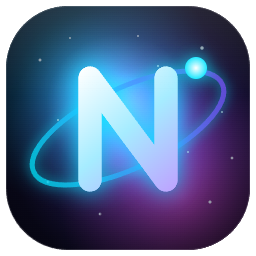

# NOVA Browser

Ein futuristischer, dunkler Browser auf Electron-Basis — mit Glassmorphism/Nebula-Design,
einem **autonomen KI-Agenten**, starkem Adblock, Spaces, Split View, integriertem Musik-Player
(Spotify, Apple Music & YouTube Music), Plugin-Store, Netzwerk-Monitor, Download-Manager und Auto-Updater.



> **v4.0.0** — Das große KI-Update: **NOVA Operator** bedient den Browser autonom für dich.

---

## 🤖 NOVA Operator — der autonome KI-Agent (neu in v4.0)

NOVA kann Aufgaben im Web **selbstständig erledigen** — angetrieben von Claude (über deinen
eingeloggten claude.ai-Account, **kein API-Key nötig**).

- **Start direkt von der Startseite:** Tippe dein Ziel in die Suchleiste und klick das **Roboter-Icon**
  (daneben gibt es den normalen Pfeil für eine ganz normale Suche). Oder **Strg/⌘ + Enter**.
- **Eigene Agenten-Bühne:** Der Agent arbeitet in einem **eigenen, animierten, nicht anklickbaren Fenster**
  rechts (oder links — frei verschiebbar per Drag & Drop, einrastbar, einklappbar als schmale Seitenleiste).
  Du siehst live, was die KI tut — bedienen kann das Fenster **nur die KI**.
- **Versteht Seiten semantisch:** scannt interaktive Elemente, navigiert, klickt, füllt Felder aus,
  wechselt eigenständig die Webseite (z. B. eine Google-Suche), schickt Formulare ab.
- **Live-Checkliste:** zeigt die geplanten Schritte und hakt sie in Echtzeit ab.
- **Recherche & Ergebnis:** Bei Info-Aufgaben liefert er am Ende eine **schön formatierte Zusammenfassung**
  als Ergebnis-Karte (mit Kopieren-Button).
- **Logins & Eingaben:** Fehlen ihm Daten, **fragt er nach** (Eingabe-Overlay). Passwörter, E-Mails &
  andere sensible Daten werden **lokal & sicher** gehalten und **direkt eingefügt — sie gehen NIE an die KI**.
- **Modell-Routing & Selbstreparatur:** wählt automatisch ein passendes, schnelles Modell
  (Haiku/Sonnet/Opus), eskaliert bei Problemen auf ein stärkeres, und repariert sich selbst
  (frischer Chat), wenn ein Schritt hängt — der Fortschritt bleibt über die Checkliste erhalten.
- **Eigene Claude-Instanz:** Der Agent läuft in einer **separaten Claude-Sitzung** — dein normaler
  Claude-Chat (Icon oben) bleibt jederzeit frei nutzbar und wird nicht zugemüllt; Agenten-Chats
  werden nach dem Lauf aufgeräumt.
- **Maximale Schritte einstellbar** (8/12/20/30 oder unbegrenzt) — jederzeit per Stopp-Button abbrechbar.

### 💬 Claude-Sidebar (NOVA AI)
Eingebettetes claude.ai als andockbares Panel (links/rechts/Split/frei) — zum Chatten, Seiten
zusammenfassen, erklären oder kritisch bewerten. Öffnet beim Klick immer einen **frischen Chat**.

### 🔒 Website-Security-Analyse (neu in v4.0.2)
Klick auf das **Schloss-Symbol** in der Adressleiste → NOVA analysiert die Seite mit Claude:
**Fingerprinting, Tracking, Drittanbieter-Skripte/-Requests, Crypto-Mining, Fake-Logins &
Daten an Drittserver**. Ergebnis als **schön animierter Report** (Risiko-Ring + Stufe + erklärte Befunde).
- Reports werden **pro Seite lokal gespeichert** und über eine **geteilte GitHub-Datenbank synchronisiert** —
  so profitieren auch Geräte **ohne Claude-Abo** von bereits geprüften Seiten.
- Beim Besuch einer bereits geprüften Seite erscheint ein **Risiko-Punkt am Schloss** + bei hohem Risiko ein
  dezenter, animierter Hinweis (kein Pop-up-Spam). Die Liste selbst ist nicht einsehbar — nur der Report zur aktuellen Seite.
- Beitragen (Hochladen neuer Scans) ist optional per **GitHub-Token** in den Einstellungen (Schreiben braucht Auth, auch bei öffentlichem Repo).

---

## ✨ Weitere Features

- 🎨 **Nebula-Design** — animierte Menüs, Akzentfarben, Hyperraum-Sprung beim Laden
- 🌌 **Echte GPU-Nebula auf der Startseite** (WebGL, volumetrischer fbm-Nebel + Sterne + Planeten + ACES-HDR) —
  Qualitätsstufen in den Einstellungen: **Niedrig** (CSS, sparsam) · **Mittel** (GPU, effizient) · **Hoch** (volle 3D-Nebula).
  Hintergrund-Tabs pausieren automatisch (auch bei 100 Tabs flüssig), Auflösung & FPS skalieren je Stufe.
- 🧭 **Tab-Leiste oben oder seitlich** (mit animiertem Nebula)
- 🛡️ **NOVA Shield** — Adblock + Tracking-Schutz (AdGuard/EasyList/uBlock-Listen, Cookie-Banner, Dark-Mode)
- 🪟 **Spaces, Split View, angepinnte Tabs, Tab-Vorschauen** — mit smoothen Ein-/Ausblend-Animationen
- 🎵 **NOVA Sound** — **Spotify, Apple Music & YouTube Music** eingebettet (Widevine-DRM),
  themen-konformes Player-Design, Mini-Player in der Topbar, Hard-Switch zwischen Diensten,
  YouTube Music werbefrei
- 🧩 **Plugin-Store (Hybrid)** — native NOVA-Plugins, Userscripts und echte Chrome-Web-Store-Erweiterungen
  (Toolbar-Icons in der Topbar; MV3-Service-Worker-Erweiterungen sind im Widevine-Build technisch begrenzt)
- 📊 **Netzwerk-Monitor** — Live-Bandbreite pro Tab
- ⬇️ **Download-Manager** — Pause/Resume, Gesamt- & Einzel-Tempolimit
- 🔄 **Auto-Updater** — prüft GitHub-Releases, aktualisiert nur nach Zustimmung
- ⭐ **Edge-Favoriten-Import**, Ordner per Drag & Drop, Befehlspalette (Strg + K)
- ⚙️ **Einstellungen** — Name, Suchmaschine, Akzentfarbe/Custom, Tab-Position, Filterlisten, KI-Agent-Schritte

---

## Starten (Entwicklung)

```bash
npm install            # lädt das castLabs-Electron (mit Widevine)
npm run fonts          # lädt die Schriftarten lokal (einmalig)
npm start
```

> **Hinweis Widevine:** Für Spotify/Apple Music wird das **castLabs-Electron** (`+wvcus`)
> verwendet. Falls `npm install` den Binär-Download nicht abschließt, lade die ZIP einmalig
> direkt und entpacke sie nach `node_modules/electron/dist` (siehe `docs/INSTALL.md`).

> **Hinweis KI-Agent:** Der NOVA Operator und die Claude-Sidebar nutzen deinen **eingeloggten
> claude.ai-Account** (kein API-Key). Beim ersten Mal einmal oben im Claude-Panel anmelden.

## Musik-Wiedergabe aktivieren (VMP-Signatur)

Spotify & Apple Music verlangen eine **produktive Widevine-Signatur**. Einmalig:

```bash
# kostenloses castLabs-Konto
python -m castlabs_evs.account signup
# App signieren
npm run sign
```

## Release bauen (portabel, Windows)

```bash
npm run dist
```

Erzeugt `release/NOVA/` mit `NOVA.exe` (startklar, inkl. Widevine-Signatur) und eine ZIP.

## Lizenz

MIT
